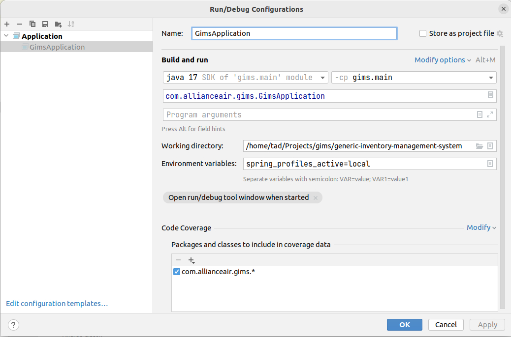

# generic-inventory-management-system
GIMS - a lightweight back end service to add items to a DB for tracking inventory.

# Running the application
For those of us who have not paid for an IntelliJ license, we can still run the spring app with the basic java run configs
```spring_profiles_active=local```
